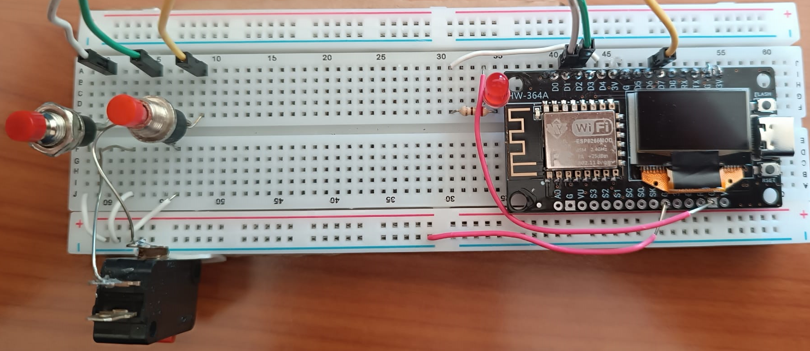

# ESP8266 Deauther 2.0

## What is New
Version 2.0:
- Completly rewritten code base for better performance and later enhancements
- Custom Deauther SDK for easy compiling using Arduino
- New serial command line interface to control and debug the program
- New display UI with a lot of new functions
- Improved web interface with multi-language support
- Improved scanning for access points and stations (+ continuous scanning mode)
- Save and select device names for both scanning and attacking
- Save up to 60 SSIDs and 25 devices in one list (you can create, load and save multiple lists)
- Added [PacketMonitor](https://github.com/spacehuhn/PacketMonitor) to display UI
- Deauth detection when scanning
- RGB LED support for a quick indication what the device is doing (attacking, scanning, ...)
- Better documentation on the new [wiki](https://github.com/spacehuhn/esp8266_deauther/wiki)

## Disclaimer
This project is a proof of concept for testing and educational purposes.  
Neither the ESP8266, nor its SDK was meant or built for such purposes. Bugs can occur!  

Use it only against your own networks and devices!  
Please check the legal regulations in your country before using it.  
I don't take any responsibility for what you do with this program.  

It is not a frequency jammer as claimed falsely by many people. Its attack, its method and how to protect against it is described above.   It uses valid Wi-Fi frames described in the IEEE 802.11 standard and doesn't block or disrupt any frequencies.  

This project is meant to draw more attention on this issue.  
The [deauthentication](https://en.wikipedia.org/wiki/Wi-Fi_deauthentication_attack) attack shows how vulnerable the 802.11 Wi-Fi standard is and that it has to be fixed.  
A solution is already there, why don't we use it?

Make sure to import theese 2 links https://arduino.esp8266.com/stable/package_esp8266com_index.json, https://raw.githubusercontent.com/SpacehuhnTech/arduino/main/package_spacehuhn_index.json to arduino additional board manager and install form board manager esp8266 deauther 

**Please don't refer to this project as "jammer", that totally undermines the real purpose of this project!**
If you do, it only proves that you didn't understand anything of what this project stands for. Publishing content about this without a proper explaination shows that you only do it for the clicks, fame and/or money and have no respect for intellectual property, the community behind it and the fight for a better WiFi standard!  

  
## Credits
A huge thanks to:
- [@deantonious](http://github.com/deantonious)
- [@jLynx](https://github.com/jLynx)
- [@lspoplove](https://github.com/lspoplove)
- [@schinfo](https://github.com/schinfo)
- [@tobozo](https://github.com/tobozo)
- [@xdavidhu](https://github.com/xdavidhu)
- [@PwnKitteh](https://github.com/PwnKitteh)
